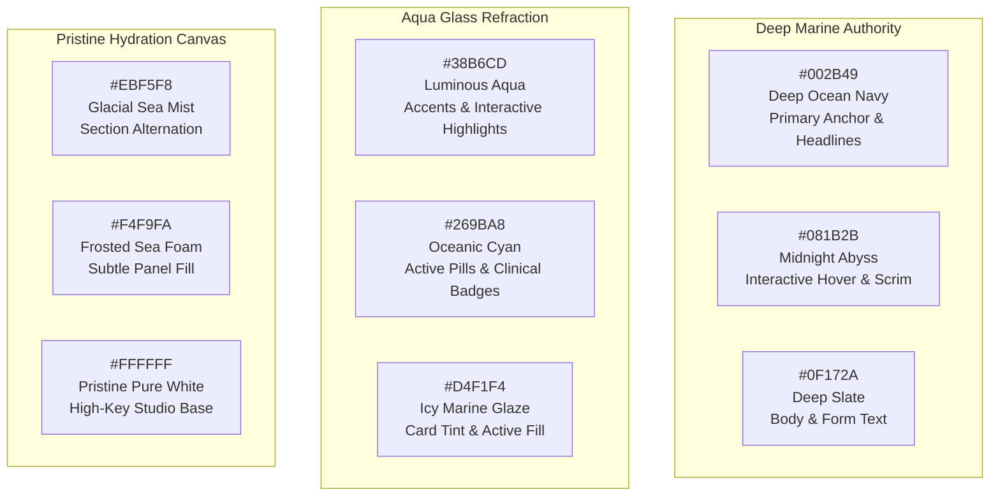

# 🌊 Numa Skin — Aqua Glass Design System & Component Anatomy
## Brand: Numa Skin (`numaskin.id`)

> **Design Theme:** Aqua Glass (Marine Mineral Glassmorphism · Crystalline Hydration · Clinical Precision)  
> **Framework:** Shopify Hydrogen (`@shopify/hydrogen@^2026.4.5`) on Shopify Oxygen Edge  
> **Engine:** React Router v7 (`7.16.0`) + Vite + Tailwind CSS v4  
> **Author & Reviewer:** Business System Architect & Full-Stack Engineering Team  
> **Last Updated:** 2026-09-27  

---

## 1. Visual Research & Asset Image Scan Analysis

A comprehensive automated colorimetric scan was executed across all physical packaging images in `public/images/products/` (587 image assets) and official campaign assets in `public/images/banners/` (117 banners).

### 1.1 Empirical Image Scan Findings

```
+---------------------------------------------------------------------------------------------------+
|                               EMPIRICAL PACKAGING & ASSET SCAN                                    |
|                                                                                                   |
|  Flagship Product                Dominant Extracted Hexes   Physical Material Character           |
|  ------------------------------  -------------------------  -----------------------------------   |
|  Deep Sea Water Treatment Lotion #C0E0F0, #B0E0F0, #D0F0F0  Translucent frosted icy cyan glass    |
|  Calming Gloss Gel Moisturizer   #C0E0F0, #D0F0F0, #C0F0F0  Aquatic jelly glass, high refraction  |
|  Swiss NAD+ 2% Booster Serum     #D0E0F0, #E0E0F0, #C5A869  Clinical frosted dropper + gold foil  |
|  Salmon PDRN Day Cream           #C0E0F0, #D0E0F0, #F0F0F0  Luminous pearl white & marine sheen   |
|  Oxydew Sunscreen SPF 50+        #50A0E0, #4090D0, #F0F0F0  Vibrant cerulean UV-barrier sky blue  |
|  Deep Sea Facial Wash Gel        #D0F0F0, #E0F0F0, #C0E0F0  Micro-bubble foam & glacial water mist|
|  Official Campaign Banners       #002B49, #0D1D40, #269BA8  Deep marine ocean authority + cyan    |
+---------------------------------------------------------------------------------------------------+
```

### 1.2 Synthesis: The "Aqua Glass" Aesthetic Invariant
The physical Numa Skin product containers are not opaque plastic; they are **frosted, semi-translucent glass bottles containing pure sea water minerals**. Light passes through them, creating soft cerulean and icy teal refractions.

The digital storefront must directly mirror this tactile experience through **Aqua Glass**:
1. **Optical Translucency:** Interfaces float over imagery with 75%–88% opacity, allowing ocean photography to shimmer through softly.
2. **Specular Rim Lighting:** A crisp, ultra-fine white/cyan highlight along top borders mimics light hitting a beveled glass edge.
3. **Deep Oceanic Shadow:** Soft, colored ambient shadows (`rgba(0, 43, 73, 0.06)`) ground floating elements without muddy black drop shadows.
4. **Clinical Calm:** Restrained, editorial typography and crisp geometric alignment replace tacky ecommerce noise.

---

## 2. Color System & Design Tokens



### 2.1 Complete Token Palette (Tailwind CSS v4 & CSS Variables)

```css
@theme {
  /* Surfaces & Aqua Glass Substrates */
  --color-canvas: #FFFFFF;                    /* Pure white page canvas */
  --color-surface-mist: #EBF5F8;              /* Soft glacial sea mist */
  --color-surface-foam: #F4F9FA;              /* Subtle sea foam fill for inputs/pills */
  --color-surface-card: #FFFFFF;              /* Solid fallback card surface */
  --color-surface-dark: #002B49;              /* Deep oceanic dark surface */
  
  /* Aqua Glass Translucent Substrates */
  --color-aqua-glass-bg: rgba(255, 255, 255, 0.78);
  --color-aqua-glass-hover: rgba(255, 255, 255, 0.92);
  --color-aqua-glass-tint: rgba(212, 241, 244, 0.35);
  --color-aqua-glass-dark: rgba(0, 43, 73, 0.72);
  --color-aqua-glass-border: rgba(255, 255, 255, 0.85);
  --color-aqua-glass-rim: rgba(56, 182, 205, 0.25);

  /* Primary Brand Marine */
  --color-brand-marine: #002B49;              /* Official authority navy */
  --color-brand-marine-hover: #081B2B;        /* Deep hover tone */
  --color-brand-cyan: #269BA8;                /* Primary mineral cyan */
  --color-brand-aqua: #38B6CD;                /* Luminous active water highlight */
  --color-brand-gold: #C5A869;                /* Prestige Swiss NAD+ gold accent */
  --color-brand-coral: #E05368;               /* Promotional discount badge */

  /* Text & Typography */
  --color-text-primary: #0F172A;              /* Slate-900 high contrast */
  --color-text-secondary: #475569;            /* Slate-600 body copy */
  --color-text-muted: #94A3B8;                /* Slate-400 meta & strike-through */
  --color-text-inverse: #FFFFFF;              /* Crisp white text */

  /* Borders & Optical Dividers */
  --color-border-hairline: #E2EDF0;           /* Clean 1px sea mist divider */
  --color-border-strong: #CBD5E1;             /* Form focus and interactive border */
  --color-border-glass: rgba(255, 255, 255, 0.85);

  /* Typography Families */
  --font-serif: "DM Serif Display", Georgia, serif;
  --font-sans: "Inter", -apple-system, BlinkMacSystemFont, "Segoe UI", Roboto, sans-serif;
  --font-mono: "JetBrains Mono", monospace;

  /* Spatial Harmonic Radii */
  --radius-xs: 2px;
  --radius-sm: 4px;                           /* Cards, tabs, clinical chips */
  --radius-md: 8px;                           /* Action buttons, search inputs */
  --radius-lg: 12px;                          /* Dialog modals, drawer frames */
  --radius-full: 9999px;                      /* 1:1 circular control icons only */
}
```

---

## 3. Aqua Glass Physics & CSS Specifications

### 3.1 Material Specification Table

| Layer Type | Background Fill | Backdrop Filter | Border & Specular Highlight | Shadow & Refraction |
|:---|:---|:---|:---|:---|
| **Aqua Glass Card** | `rgba(255, 255, 255, 0.75)` with subtle `rgba(212, 241, 244, 0.15)` | `blur(14px)` | `1px solid rgba(255, 255, 255, 0.85)` | `inset 0 1px 1px rgba(255,255,255,0.9)`, `0 8px 30px rgba(0,43,73,0.05)` |
| **Aqua Glass Panel** | `rgba(255, 255, 255, 0.88)` | `blur(20px)` | `1px solid rgba(255, 255, 255, 0.9)` | `inset 0 1px 2px rgba(255,255,255,1)`, `0 16px 40px rgba(0,43,73,0.08)` |
| **Aqua Glass Dark** | `rgba(0, 43, 73, 0.70)` | `blur(18px)` | `1px solid rgba(255, 255, 255, 0.18)` | `inset 0 1px 1px rgba(255,255,255,0.25)`, `0 12px 36px rgba(0,0,0,0.3)` |
| **Aqua Glass Pill** | `rgba(255, 255, 255, 0.65)` | `blur(8px)` | `1px solid rgba(255, 255, 255, 0.75)` | `0 2px 8px rgba(0,43,73,0.03)` |
| **Aqua Glass Button**| `rgba(255, 255, 255, 0.90)` | `blur(10px)` | `1px solid rgba(255, 255, 255, 0.95)` | `0 4px 16px rgba(0,43,73,0.06), 0 0 12px rgba(56,182,205,0.12)` |

### 3.2 CSS Utility Implementation (`app/styles/app.css`)

```css
/* Aqua Glass Master Utility Classes */
.aqua-glass-card {
  background: linear-gradient(135deg, rgba(255, 255, 255, 0.82) 0%, rgba(240, 249, 251, 0.65) 100%);
  backdrop-filter: blur(14px);
  -webkit-backdrop-filter: blur(14px);
  border: 1px solid rgba(255, 255, 255, 0.85);
  box-shadow: inset 0 1px 1.5px 0 rgba(255, 255, 255, 0.9), 
              0 8px 30px 0 rgba(0, 43, 73, 0.05);
  transition: all 0.3s cubic-bezier(0.16, 1, 0.3, 1);
}

.aqua-glass-card:hover {
  background: linear-gradient(135deg, rgba(255, 255, 255, 0.92) 0%, rgba(224, 242, 254, 0.75) 100%);
  border-color: rgba(255, 255, 255, 0.98);
  box-shadow: inset 0 1px 2px 0 rgba(255, 255, 255, 1), 
              0 14px 40px -4px rgba(0, 43, 73, 0.1),
              0 0 20px -2px rgba(56, 182, 205, 0.18);
  transform: translateY(-2px);
}

.aqua-glass-panel {
  background: linear-gradient(180deg, rgba(255, 255, 255, 0.90) 0%, rgba(244, 250, 252, 0.85) 100%);
  backdrop-filter: blur(20px);
  -webkit-backdrop-filter: blur(20px);
  border: 1px solid rgba(255, 255, 255, 0.9);
  box-shadow: inset 0 1px 2px 0 rgba(255, 255, 255, 1),
              0 18px 48px -4px rgba(0, 43, 73, 0.08);
}

.aqua-glass-dark {
  background: linear-gradient(135deg, rgba(0, 43, 73, 0.75) 0%, rgba(8, 27, 43, 0.82) 100%);
  backdrop-filter: blur(18px);
  -webkit-backdrop-filter: blur(18px);
  border: 1px solid rgba(255, 255, 255, 0.18);
  box-shadow: inset 0 1px 1px 0 rgba(255, 255, 255, 0.25),
              0 12px 36px 0 rgba(0, 0, 0, 0.28);
}

.aqua-glass-pill {
  background: rgba(255, 255, 255, 0.68);
  backdrop-filter: blur(8px);
  -webkit-backdrop-filter: blur(8px);
  border: 1px solid rgba(255, 255, 255, 0.8);
  box-shadow: 0 2px 8px 0 rgba(0, 43, 73, 0.03);
}

.aqua-glass-button {
  background: linear-gradient(180deg, rgba(255, 255, 255, 0.95) 0%, rgba(240, 248, 250, 0.88) 100%);
  backdrop-filter: blur(12px);
  -webkit-backdrop-filter: blur(12px);
  border: 1px solid rgba(255, 255, 255, 0.95);
  box-shadow: inset 0 1px 1.5px 0 rgba(255, 255, 255, 1),
              0 4px 16px 0 rgba(0, 43, 73, 0.06),
              0 0 12px 0 rgba(56, 182, 205, 0.14);
  transition: all 0.25s ease;
}

.aqua-glass-button:hover {
  background: #FFFFFF;
  box-shadow: inset 0 1px 2px 0 rgba(255, 255, 255, 1),
              0 8px 24px 0 rgba(0, 43, 73, 0.1),
              0 0 18px 0 rgba(56, 182, 205, 0.28);
}
```

---

## 4. Component Anatomy Specifications

### 4.1 Header Anatomy (Seamless 100dvh Floating + Frosted Aqua Transition)

```
+---------------------------------------------------------------------------------------------------------------+
| TOP ANNOUNCEMENT BAR: "GRATIS ONGKIR SE-INDONESIA MIN. RP 200.000 · 100% RESMI BPOM RI · HALAL INDONESIA"     |
+---------------------------------------------------------------------------------------------------------------+
| [Menu]  KOLEKSI (Mega Menu)   PAKET BUNDLING   ANTI-AGING   THE SCIENCE      NUMA · SKIN     [Q]  [User] [Bag]|
+---------------------------------------------------------------------------------------------------------------+
```

#### Anatomical Constraints:
1. **Brand Identity:** The center brandmark features `NUMA · SKIN` in tracked geometric sans (`tracking-[0.22em] font-medium`) with the Japanese Katakana heritage `ヌマスキン` positioned delicately beneath (`text-[10px] tracking-[0.35em]`).
   - The English subtitle `J-BEAUTY CLINICAL SCIENCE` is removed from the Header, keeping the brand signature ultra-refined and uncluttered.
2. **Seamless Zero-Border Rule:** Header has `border-none` at all times. No divider line separates Header from Hero.
3. **Dual State Transitions:**
   - **At Page Top (Homepage):** `absolute top-9 left-0 right-0 bg-transparent text-white z-40`. Navigation links and brandmark are crisp white.
   - **Upon Scroll (> 20px):** `fixed top-0 left-0 right-0 bg-white/90 backdrop-blur-2xl shadow-[0_4px_30px_rgba(0,43,73,0.06)] text-slate-800 z-40`. Brandmark shifts to `#002B49`.
4. **Action Trinity (Right Column):**
   - Direct Search Trigger (`<Search className="w-5 h-5" />`).
   - Customer Account Link (`<User className="w-5 h-5" />`).
   - Cart Trigger with optimistic badge count pill.

---

### 4.2 Hero Slider Anatomy (`<HeroBanner />` — 100dvh Dynamic Viewport)

```
+---------------------------------------------------------------------------------------------------------------+
| [100dvh HERO CONTAINER: FULL VIEWPORT COVERAGE, OVERFLOW HIDDEN]                                             |
|                                                                                                               |
|  [<]  AQUA GLASS CONTENT CARD                     DESKTOP CAMPAIGN SHOWCASE CARD                        [>]   |
|       - Formula Kicker Pill: ULLEUNG MINERALS     - Frosted glass container                                   |
|       - DM Serif Display Headline                 - High-res product studio crop                              |
|       - Clinical Proof Body Copy                  - Campaign tag & slide counter (01 / 05)                    |
|       - Dual High-Contrast CTAs                                                                               |
|       - 4 Micro-Trust Metrics (BPOM, 0% Alkohol)                                                              |
|                                                                                                               |
|  [ DOCK INDICATOR: 01 · 02 · 03 · 04 · 05 ]         [ SCROLL UNTUK EKSPLORASI ]                               |
+---------------------------------------------------------------------------------------------------------------+
```

#### Anatomical Constraints:
1. **Viewport Height:** Exactly `h-[100dvh] min-h-[640px] max-h-[1080px]`.
2. **Carousel Engine:** 5 curated official campaign slides with 6-second auto-rotation, pause-on-hover, touch swipe gesture support, and floating frosted glass navigation arrows (`ChevronLeft`, `ChevronRight`).
3. **Contrast Gradient Scrim:** Directional ocean gradient (`from-[#002B49]/95 via-[#002B49]/70 to-[#002B49]/30 lg:to-transparent`) guarantees WCAG AAA legibility over all photographic backgrounds.
4. **Bottom Dock:** Frosted glass pill indicators (`01` through `05`) and subtle bounce scroll indicator ("SCROLL UNTUK EKSPLORASI").

---

### 4.3 Product Card Anatomy (`<ProductCard />` — Aqua Glass Elevation)

```
+--------------------------------------------------------+
| [PRODUCT IMAGE VIEWPORT - ASPECT 4:5]                  |
|                                                        |
|  [HEMAT 36%] (Coral Pill)         [BPOM RESMI] (Pill)  |
|                                                        |
|               (HIGH-RES BOTTLE STUDIO CROP)            |
|                                                        |
|  [QUICK ADD TO CART OVERLAY - HOVER STATE]             |
+--------------------------------------------------------+
|  FORMULATION KICKER: ULLEUNG DEEP SEA WATER 83%        |
|  PRODUCT TITLE: Deep Sea Water Treatment Lotion 150ml  |
|  INGREDIENTS CHIP: 14 Mineral Esensial · Hyaluronic    |
|                                                        |
|  Rp 149.000           Rp 235.000 (Muted Strike)        |
+--------------------------------------------------------+
```

#### Anatomical Constraints:
1. **Container Styling:** `.aqua-glass-card` with 4px border radius (`rounded-sm`), subtle white specular border, and oceanic hover glow.
2. **Image Aspect Ratio:** Clean 4:5 vertical proportion showcasing bottle details, water droplets, and mineral clarity.
3. **Badge Anchoring:**
   - Top Left: Discount pill in coral `#E05368` (e.g. `HEMAT 36%`).
   - Top Right: BPOM verification pill in frosted aqua glass (`BPOM NA...`).
4. **Interactive Quick-Add:** On desktop hover, an Aqua Glass Action Bar slides up smoothly from the bottom of the image container with one-click cart addition.

---

### 4.4 4-Step Routine Stepper Anatomy (`<RoutineStepper />`)

```
+---------------------------------------------------------------------------------------------------------------+
|  THE 4-STEP MARINE RITUAL · PENYERAPAN MAKSIMAL DALAM 4 LANGKAH KLINIS                                        |
|                                                                                                               |
|  +------------------+  +------------------+  +------------------+  +------------------+                       |
|  | STEP 01: CLEANSE |  | STEP 02: HYDRATE |  | STEP 03: ACTIVATE|  | STEP 04: PROTECT |                       |
|  | Deep Sea Facial  |  | Treatment Lotion |  | Swiss NAD+ Serum |  | Oxydew Sunscreen |                       |
|  | Wash Gel 100ml   |  | 150ml            |  | 20ml             |  | SPF 50+ PA++++   |                       |
|  +------------------+  +------------------+  +------------------+  +------------------+                       |
|                                                                                                               |
|  [ BUNDLE CALLOUT: BELI COMPLETE ROUTINE 4-IN-1 · HEMAT RP 285.000 · Rp 399.000 ]  [ TAMBAH LENGKAP KE BAG ]  |
+---------------------------------------------------------------------------------------------------------------+
```

#### Anatomical Constraints:
1. **Educational Sequence:** Guides the customer systematically from Cleanse -> Hydrate -> Activate -> Protect.
2. **AOV Multiplier:** A prominent frosted Aqua Glass summary bar at the bottom provides instant 1-click addition of the entire 4-item bundle into the cart drawer.

---

## 5. Zero-AI-Slop Governance & Verification

All UI components and copy must adhere strictly to these non-negotiable rules:
- [x] **Zero Emojis:** Interface labels, headings, and badges contain no decorative emoji icons.
- [x] **No Cheap Sparkles or Wand Icons:** Replaced by clean monospace metadata chips (`font-mono text-[10px] tracking-widest uppercase`).
- [x] **No Tacky Pulsing Animations:** Animations are restricted to user-initiated hover states, slide transitions, and micro-refractions.
- [x] **Consistent Brandmark:** `NUMA · SKIN` with middle dot (`\u00B7`) across Header, Drawer, Footer, and Meta.
- [x] **Verified BPOM & Halal Accuracy:** All certification chips display genuine BPOM registration codes and Indonesian clinical claims.
