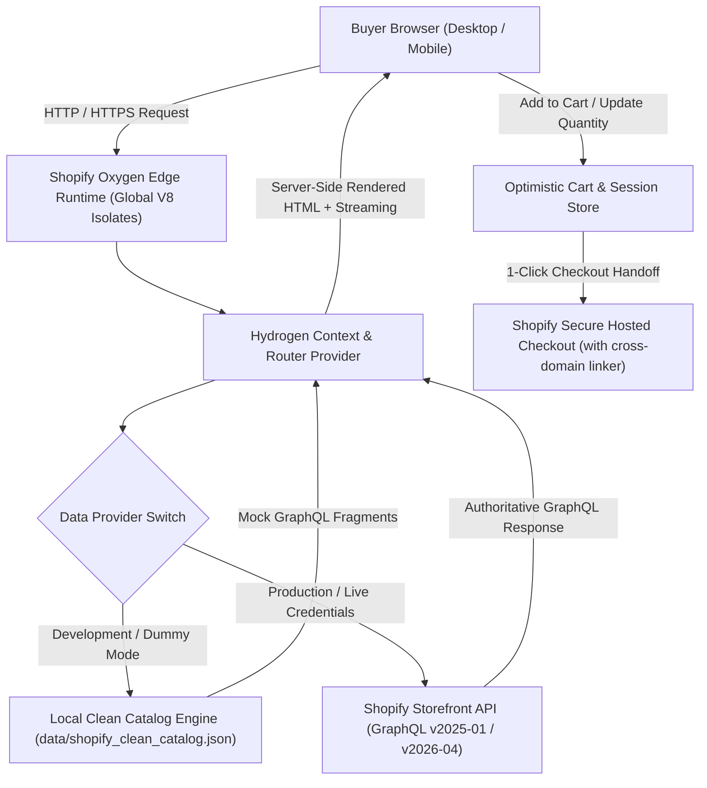
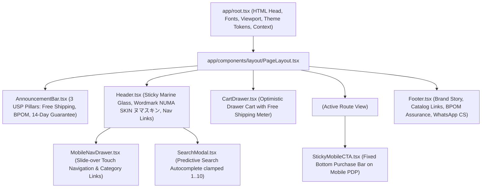
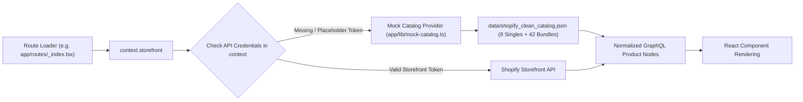

# 🗺️ System Route & Architecture Map (SYSTEM-MAP.md)
## Project: Numa Skin Headless E-Commerce Flagship (`numaskin.id`)

> **Developer Navigation Reference**: Peta arsitektur menyeluruh halaman per halaman, route tree, data fetching (dengan dummy/mock catalog fallback), komponen penyusun, state interaktif, dan SEO metadata untuk memandu navigasi dan pengembangan storefront Shopify Hydrogen.

---

## 1. High-Level System Architecture & Flow

---

## 2. Global Persistent Shell & Frame Architecture

Setiap halaman di storefront dibungkus oleh layout shell global yang didefinisikan pada [`app/root.tsx`](file:///Users/ongki/Projects/numaskin.id/app/root.tsx) dan [`app/components/layout/PageLayout.tsx`](file:///Users/ongki/Projects/numaskin.id/app/components/layout/PageLayout.tsx).

---

## 3. Page-by-Page Detailed Blueprint & Route Specifications

### 3.1 Beranda / Home Page (`/`)
- **Route File**: [`app/routes/_index.tsx`](file:///Users/ongki/Projects/numaskin.id/app/routes/_index.tsx)
- **Primary Layout / Canvas**: Pure Crisp White Canvas (`#FFFFFF`) with alternating Sea Mist tint sections (`#EBF5F8`).
- **Data Loaders & Cache Policy**:
  - `homeLoader`: Featured 8 Core Singles, Best Selling Bundles, Campaign Banners metadata, and 4-Step Routine mapping.
  - **Edge Cache**: `stale-while-revalidate` (`max-age=60`, `stale-while-revalidate=540`).
- **Component Hierarchy**:
  1. [`HeroBanner.tsx`](file:///Users/ongki/Projects/numaskin.id/app/components/home/HeroBanner.tsx): Full-bleed visual banner featuring Asian model glass skin, directional left-hand dark ocean scrim (`from-[#0D1D40]/95`), and dual CTAs (`JELAJAHI KATALOG` + `LIHAT PAKET HEMAT`).
  2. [`TrustBadgesBar.tsx`](file:///Users/ongki/Projects/numaskin.id/app/components/home/TrustBadgesBar.tsx): Architectural strip displaying official trust badges (BPOM RI Resmi, Halal Indonesia, Dermatologically Tested, 0% Alkohol, Ulleung Deep Sea Water).
  3. [`RoutineStepper.tsx`](file:///Users/ongki/Projects/numaskin.id/app/components/home/RoutineStepper.tsx): Interactive 4-step ritual (`01 Cleanse` → `02 Tone` → `03 Treat` → `04 Protect`) with 1-click bundle purchase banner ("Paket Complete Routine 4-in-1: Hemat Rp 122.750").
  4. [`CuratedSinglesGrid.tsx`](file:///Users/ongki/Projects/numaskin.id/app/components/home/CuratedSinglesGrid.tsx): 4-column desktop / 2-column mobile grid of 8 Singles with instant texture preview and quick ATC trigger.
  5. [`ActiveIngredientsSpotlight.tsx`](file:///Users/ongki/Projects/numaskin.id/app/components/home/ActiveIngredientsSpotlight.tsx): Clinical deep dive into Ulleung Island Deep Sea Water, 2% NAD+, Adenosine, Salmon PDRN, and Meadowestolide.
  6. [`AmbassadorSpotlight.tsx`](file:///Users/ongki/Projects/numaskin.id/app/components/home/AmbassadorSpotlight.tsx): Sahrul Gunawan & Dine Pearl editorial campaign block showcasing the 14-day anti-aging transformation.
  7. [`BundleSavingsMatrix.tsx`](file:///Users/ongki/Projects/numaskin.id/app/components/home/BundleSavingsMatrix.tsx): Visual comparison matrix demonstrating 30%–45% savings across 42 curated bundles.
  8. [`ReviewsCarousel.tsx`](file:///Users/ongki/Projects/numaskin.id/app/components/home/ReviewsCarousel.tsx): Verified buyer testimonials with skin concern tags (*Flek Hitam, Kulit Kering, Barrier Rusak*).
  9. [`FaqAccordion.tsx`](file:///Users/ongki/Projects/numaskin.id/app/components/home/FaqAccordion.tsx): 6 key customer objections answered (BPOM legality, pregnancy safety, shipping duration, sensitive skin guarantee).
- **SEO & Structured Data**:
  - Title: `Numa Skin Official — Solusi Kulit Awet Muda dengan Ulleung Deep Sea Water & 2% NAD+`
  - Meta Description: `Katalog resmi Numa Skin Indonesia. Formula J-Beauty klinis berbahan dasar Deep Sea Water, 2% NAD+, dan Salmon PDRN terdaftar BPOM untuk peremajaan kulit wajah.`
  - JSON-LD: `Organization`, `WebSite` (with SearchAction), `BreadcrumbList`.

---

### 3.2 Katalog Koleksi Indeks (`/collections`)
- **Route File**: [`app/routes/collections._index.tsx`](file:///Users/ongki/Projects/numaskin.id/app/routes/collections._index.tsx)
- **Fungsi**: Direktori induk 7 koleksi kurasi resmi Numa Skin.
- **Component Hierarchy**:
  - Header direktori dengan kicker `OFFICIAL NUMA DIRECTORY · 7 KOLEKSI PILIHAN`.
  - Responsive Grid 7 Kategori (`all-products`, `cleanser-toner`, `serum-treatment`, `moisturizer-day-cream`, `sunscreen-protection`, `paket-hemat-bundling`, `anti-aging-series`).
- **SEO & Meta**:
  - Title: `Koleksi Lengkap Perawatan Kulit — Numa Skin Official`
  - Canonical: `https://numaskin.id/collections`
  - JSON-LD: `CollectionPage`, `BreadcrumbList`.

---

### 3.3 Halaman Listing Koleksi Produk (`/collections/:handle`)
- **Route File**: [`app/routes/collections.$handle.tsx`](file:///Users/ongki/Projects/numaskin.id/app/routes/collections.$handle.tsx)
- **Contoh URL**:
  - `/collections/all` (Semua Katalog 50 Produk)
  - `/collections/paket-hemat-bundling` (42 Paket Hemat & Routine Sets)
  - `/collections/serum-treatment` (Serum NAD+ & Konsentrat Perawatan)
  - `/collections/cleanser-toner` (Pembersih Wajah & Hydrating Toner)
- **Data Loaders & Invariants**:
  - **Grid-Proportional Pagination**: Desktop menampilkan kelipatan 4 tepat (12 produk per halaman = 4x3) untuk mencegah kartu tunggal menggantung (*orphan cards*).
  - Faceted filters (Kategori, Tipe Kulit, Rentang Harga) & Sorting dropdown.
- **Component Hierarchy**:
  - [`CollectionHero.tsx`](file:///Users/ongki/Projects/numaskin.id/app/components/collection/CollectionHero.tsx): Banner minimalis bernapas dengan latar warna Sea Mist (`#EBF5F8`).
  - [`FilterDrawer.tsx`](file:///Users/ongki/Projects/numaskin.id/app/components/collection/FilterDrawer.tsx): Filter drawer geser untuk mobile & faceted sidebar untuk desktop.
  - [`ProductGrid.tsx`](file:///Users/ongki/Projects/numaskin.id/app/components/product/ProductGrid.tsx): 4-kolom desktop / 2-kolom mobile.
  - [`Pagination.tsx`](file:///Users/ongki/Projects/numaskin.id/app/components/common/Pagination.tsx): Navigasi cursor halaman.
- **SEO & Meta**:
  - Title: `{Collection.title} — Numa Skin Official`
  - JSON-LD: `CollectionPage`, `ItemList`, `BreadcrumbList`.

---

### 3.4 Halaman Detail Produk / PDP (`/products/:handle`)
- **Route File**: [`app/routes/products.$handle.tsx`](file:///Users/ongki/Projects/numaskin.id/app/routes/products.$handle.tsx)
- **Contoh URL**:
  - `/products/numa-skin-deep-sea-water-treatment-lotion-150ml`
  - `/products/numa-skin-nad-booster-anti-aging-serum-20ml`
  - `/products/numa-skin-paket-lengkap-6-in-1-routine`
- **Component Hierarchy (Split Layout 55% Media / 45% Purchase)**:
  - **Left Column (55% Desktop Width)**:
    - [`ProductGallery.tsx`](file:///Users/ongki/Projects/numaskin.id/app/components/product/ProductGallery.tsx): Galeri gambar resolusi tinggi dengan pinch-to-zoom, preview tekstur botol, dan thumbnail switcher.
    - [`ClinicalProofCard.tsx`](file:///Users/ongki/Projects/numaskin.id/app/components/product/ClinicalProofCard.tsx): Kotak hasil uji klinis 14 hari (98% kulit terhidrasi, 92% kemerahan reda).
  - **Right Column (45% Desktop Width - Sticky Scroll)**:
    - Kicker BPOM resmi (`font-mono text-xs text-brand-cyan`).
    - Judul produk h1 tebal + Subtitle khasiat (*Pembersih Wajah Lembut Anti-Aging & Mencerahkan*).
    - Blok harga Rupiah bersih (`formatRupiah`), harga coret, dan pill diskon (`bg-brand-marine text-white font-mono`).
    - **Variant Picker**: Tombol ukuran murni (`150ml Full Size` vs `50ml Travel Size`). Varian sintetis `Default Title` disembunyikan otomatis.
    - **Routine Upsell Checkbox ("Lengkapi Rangkaian Anda")**: Opsi 1-klik menambahkan produk pelengkap langkah berikutnya dengan harga bundling.
    - Dual CTA: `TAMBAH KE KERANJANG` (Optimistic Drawer) & `BELI SEKARANG` (Direct Checkout Link).
    - **Accordion Tabs**: Manfaat Utama, Kandungan Aktif (Ulleung Sea Water, Niacinamide), Cara Pakai Pagi/Malam, Nomor BPOM & Keamanan Bumil.
  - **Mobile Only Floating CTA**:
    - [`StickyMobileCTA.tsx`](file:///Users/ongki/Projects/numaskin.id/app/components/product/StickyMobileCTA.tsx): Bar pembelian menempel di bagian bawah layar HP saat tombol utama ter-scroll lewat.
- **SEO & Meta**:
  - Title: `{Product.title} — Numa Skin Official`
  - JSON-LD: `Product` (dengan penawaran harga IDR, ketersediaan, rating review, brand Numa Skin).

---

### 3.5 Slide-out Optimistic Cart Drawer (`<CartDrawer />`)
- **File**: [`app/components/cart/CartDrawer.tsx`](file:///Users/ongki/Projects/numaskin.id/app/components/cart/CartDrawer.tsx)
- **Interaksi**:
  - Menggeser masuk dari sisi kanan layar (`max-w-md w-full bg-white`).
  - **Free Shipping Progress Bar**: Target Rp 200.000 dengan meteran Cyan (`#269BA8`) dinamis.
  - Line items dengan thumbnail, judul varian, tombol jumlah numeric `- / +`, dan tombol hapus instan.
  - **In-Cart 1-Click Upsell**: Penawaran travel size toner (50ml) atau facial wash langsung dari dalam drawer.
  - **Checkout Button**: Membawa pembeli langsung ke checkout Shopify resmi dengan parameter atribusi (`checkout.js`).

---

### 3.6 Pencarian Prediktif Pintar (`/search`)
- **Route File**: [`app/routes/search.tsx`](file:///Users/ongki/Projects/numaskin.id/app/routes/search.tsx)
- **Constraint Penting**: Limit GraphQL `predictiveSearch` dijaga ketat pada rentang `1..10` (`Math.min(10, Math.max(1, limit))`) agar tidak memicu error schema Storefront API.
- **Fitur**: Pencarian instan produk, artikel, dan koleksi berdasarkan nama bahan aktif (misal ketik *"NAD"*, *"Toner"*, *"Flek"*).

---

### 3.7 Halaman Konten & Edukasi (`/pages/:handle`)
- **Route File**: [`app/routes/pages.$handle.tsx`](file:///Users/ongki/Projects/numaskin.id/app/routes/pages.$handle.tsx)
- **Halaman Khusus**:
  - `/pages/about` — Kisah Numa Skin, Filosofi J-Beauty & Kolaborasi Sahrul Gunawan.
  - `/pages/science` — Sains Laut Dalam Ulleung Island, 2% NAD+ Cellular Longevity & Salmon PDRN.
  - `/pages/bpom` — Direktori Izin Edar Resmi Badan POM RI & Sertifikat Halal.
  - `/pages/faq` — Pusat Bantuan, Pengiriman & Garansi Kulit 14 Hari.

---

## 4. State Management & Data Provider Fallback (Dummy vs Live)

Dengan arsitektur ini, seluruh tampilan storefront dapat langsung di-develop, ditest, dan dipratinjau secara lokal dengan data katalog lengkap Numa Skin tanpa hambatan kredensial API!
