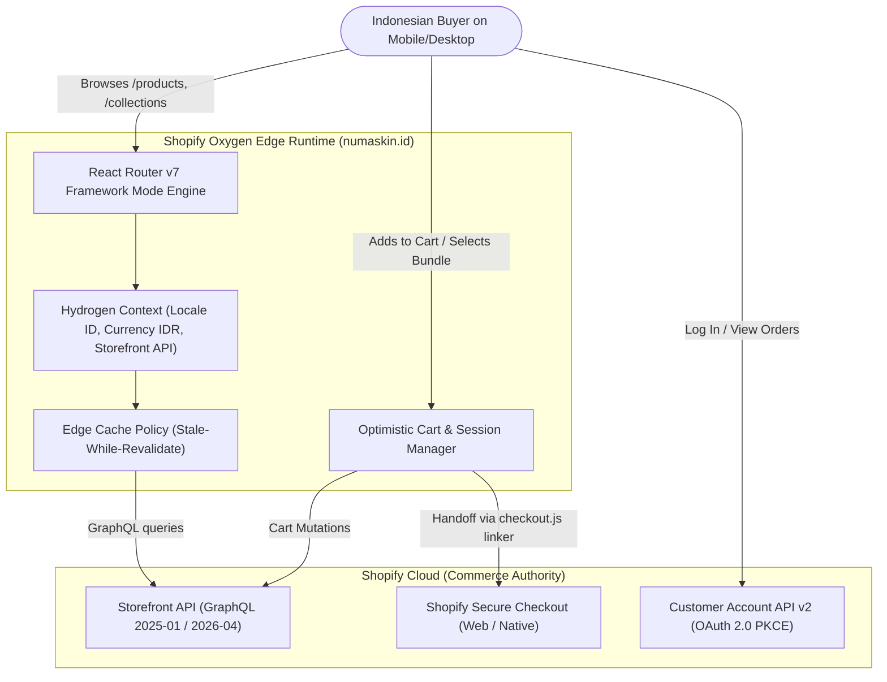

# PRD — Numa Skin Hydrogen Headless Storefront

> **Domain:** [numaskin.id](https://numaskin.id) · **Platform:** Shopify Hydrogen (`@shopify/hydrogen@^2026.4.5`)
> **Framework:** React Router v7 (`7.16.0`) + Vite + Tailwind CSS v4 on Shopify Oxygen Edge Runtime
> **Storefront API:** `2025-01` / `2026-04` · **Primary Currency:** IDR (`Rp`) · **Active Market:** ID (Primary)
> **Brand Profile:** J-Beauty / Clinical Sea Science Anti-Aging & Barrier Longevity Skincare
> **Brand Ambassador:** Sahrul Gunawan & Dine Pearl (#AwetMudaBersama)

---

## 1. Executive Summary & Product Vision

### 1.1 Brand Identity & Mission
Numa Skin (ヌマスキン / Numa-Skin) is an Indonesian-Japanese clinical skincare brand positioned at the intersection of **deep ocean marine mineral science** and **cellular longevity dermatological actives**. 

The brand's core mission is to democratize prestige anti-aging skincare for Indonesian consumers across all life stages under the official campaign mottos:
- **"Muda untuk Masa Depan #TimelessDNA"**
- **"#AwetMudaBersama"** (led by Brand Ambassadors Sahrul Gunawan & Dine Pearl)

### 1.2 The Hydrogen Headless Mandate
Numa Skin's current e-commerce presence has been heavily marketplace-reliant (Shopee Official Shop, TikTok Shop). The strategic launch of the **numaskin.id** official headless storefront powered by Shopify Hydrogen serves three critical business mandates:
1. **Direct-to-Consumer (D2C) Sovereignty:** Capture first-party customer data, build customer lifetime value (LTV), and eliminate marketplace commissions (8–12%).
2. **Clinical Luxury Brand Experience:** Marketplace product cards are cluttered with promotional badges, flash banners, and price wars. A custom Hydrogen storefront delivers a bespoke, calm, breathable J-Beauty aesthetic comparable to global D2C flagships (Rhode Skin, Glossier, Aesop).
3. **Sub-Second Performance & Edge Speed:** Mobile shopping in Indonesia faces unpredictable 4G/5G connections. Powered by Shopify Oxygen edge workers worldwide, the storefront delivers instantaneous page loads, optimistic cart operations, and streaming SSR without liquid theme overhead.

---

## 2. Market Positioning, Audience & Personas

### 2.1 Competitive Positioning
```
                         HIGH CLINICAL PRESTIGE
                               ▲
                               │     [Numa Skin]
                               │     (Ulleung Deep Sea Water,
                 [Skintific]   │      NAD+ 2%, Salmon PDRN,
                 (Barrier/     │      Adenosine, Meadowestolide)
                  5X Ceramide) │
                               │     [Somethinc]
MASS MARKET ◄──────────────────┼──────────────────► LUXURY / D2C EDITORIAL
(Marketplace Heavy)            │                    (Rhode, Glossier)
                               │
                 [The Originote]
                               │
                               ▼
                         VALUE / ENTRY TIER
```

### 2.2 Target Demographics
| Attribute | Primary Segment (The Rejuvenation Seeker) | Secondary Segment (The Barrier Repairer) |
|:---|:---|:---|
| **Age** | 28 – 48 years old | 20 – 32 years old |
| **Gender** | Female & Male (Couples / Family, reflected in Sahrul Gunawan campaign) | Female (75%), Male (25%) |
| **Primary Skin Concerns** | Fine lines, wrinkles, loss of elasticity, stubborn dark spots (flek hitam), dullness | Dehydrated skin, damaged skin barrier, redness, sensitivity, acne-prone |
| **Key Hero SKUs** | NAD+ Booster Serum, Adenosine Moisturizer, PDRN Day Cream | Deep Sea Water Treatment Lotion, Gloss Gel Moisturizer, Facial Wash Gel |
| **Shopping Mindset** | Seeks visible 14-day results, clinical legitimacy (BPOM, Dermatologically Tested), high trust | Values soothing texture, non-sticky dewy glow, zero alcohol/fragrance |
| **Buying Behavior** | High affinity for complete routine sets (3-in-1, 4-in-1, 6-in-1 Routine Bundles) | Repeat purchaser of single essentials (Toner 150ml + Sunscreen SPF 50+) |

---

## 3. Product Catalog Architecture

The storefront catalog is pre-structured into **8 Core Singles**, **42 Curated Bundles**, and **7 Navigation Collections**.

### 3.1 8 Core Singles (Hero Formulations)
1. **Numa Skin Deep Sea Water Facial Wash Gel 100ml** (`numa-skin-deep-sea-water-facial-wash-100ml`)
   - *Price:* Rp 68.999 (Normal: Rp 98.750, 30% OFF) · *BPOM:* `NA18241203644`
   - *Actives:* Ulleung Deep Sea Water, 5% Niacinamide, Vitamin E & Glycerin. Non-stripping gel cleanser.
2. **Numa Skin Deep Sea Water Treatment Lotion 150ml** (`numa-skin-deep-sea-water-treatment-lotion-150ml`)
   - *Price:* Rp 79.000 (Normal: Rp 123.750, 36% OFF) · *BPOM:* `NA18220101675`
   - *Actives:* Pristine Deep Sea Water, Multi-Moisturizing Complex, Anti-Irritant Actives. Full size hydrating toner & essence.
3. **Numa Skin Deep Sea Water Treatment Lotion 50ml** (`numa-skin-deep-sea-water-treatment-lotion-50ml`)
   - *Price:* Rp 79.000 (Normal: Rp 123.750, 36% OFF) · *BPOM:* `NA18220101675`
   - *Travel Size edition for on-the-go barrier hydration.*
4. **Numa Skin Adenosine Deep Sea Water Moisturizer 30g** (`numa-skin-adenosine-deep-sea-water-moisturizer-30g`)
   - *Price:* Rp 78.999 (Normal: Rp 121.250, 35% OFF) · *BPOM:* `NA18230107871`
   - *Actives:* Adenosine, Deep Sea Water Infusion, Phytosqualane. Firming anti-wrinkle moisturizer in hygienic pump tube.
5. **Numa Skin Calming Barrier Gloss Gel Moisturizer 30ml** (`numa-skin-calming-barrier-gloss-gel-moisturizer-30ml`)
   - *Price:* Rp 79.000 (Normal: Rp 123.750, 36% OFF) · *BPOM:* `NA18230100779`
   - *Actives:* Meadowestolide, Astragalus Root Extract, Ceramide Complex. Lightweight soothing gloss gel for instant glass skin glow.
6. **Numa Skin PDRN Alpha Arbutin Tone-Up Day Cream 30g** (`numa-skin-pdrn-alpha-arbutin-tone-up-day-cream-30g`)
   - *Price:* Rp 79.499 (Normal: Rp 99.735, 20% OFF) · *BPOM:* `NA18240107890`
   - *Actives:* Salmon PDRN DNA, Alpha Arbutin, Physical UV Filters. Instant brightening tone-up with cellular renewal.
7. **Numa Skin Oxydew Sunscreen Luceane SPF 50+ PA++++ 30ml** (`numa-skin-oxydew-sunscreen-luceane-spf50-30ml`)
   - *Price:* Rp 79.000 (Normal: Rp 123.750, 36% OFF) · *BPOM:* `NA18241700684`
   - *Actives:* Photostable Hybrid UV Filters, Antioxidant Complex. Lightweight ocean-friendly sunscreen, zero white cast, anti-pollution.
8. **Numa Skin NAD+ Booster Anti-Aging Serum 20ml** (`numa-skin-nad-booster-anti-aging-serum-20ml`)
   - *Price:* Rp 108.999 (Normal: Rp 171.250, 36% OFF) · *BPOM:* `NA18242000231`
   - *Actives:* 2% Pure NAD+, 4% Niacinamide, 4X Peptide Complex, 4D Hyaluronic Acid. High-potency cellular longevity concentrate.

### 3.2 42 Bundling & Routine Sets Strategy
Bundles form the backbone of the storefront's Average Order Value (AOV) strategy:
- **Flagship Regimen:** *Paket Lengkap 6-in-1 Routine* (Rp 524.500) & *Paket Ultimate Anti-Aging 150ml* (Rp 485.500).
- **Core Trios:** *Paket Anti-Aging Trio*, *Paket Age Repair Trio*, *Paket Triple Protection 3-in-1* (Rp 257.000 – Rp 297.000).
- **Targeted Duos:** *Skin Protection Duo* (NAD+ Serum + Sunscreen), *Clean & Glow Duo*, *Daily Protection Duo* (Rp 148.000 – Rp 218.000).
- **Daily Essentials Duos:** Flash value pairing (Sunscreen + Gloss Gel, Toner + Adenosine) at accessible entry price points.

### 3.3 7 Store Navigation Collections
1. `all-products` — Katalog Lengkap Numa Skin
2. `cleanser-toner` — Pembersih Wajah & Hydrating Toner
3. `serum-treatment` — Serum NAD+ & Konsentrat Perawatan Intensif
4. `moisturizer-day-cream` — Pelembap Gel, Krim Adenosine & Tone-Up PDRN
5. `sunscreen-protection` — Tabir Surya Oxydew SPF 50+ PA++++
6. `paket-hemat-bundling` — 42 Paket Hemat & Rangkaian Rutin Perawatan
7. `anti-aging-series` — Formulasi Khusus Rejuvenasi & Kulit Awet Muda

---

## 4. Key Functional Features & Architecture



### 4.1 Route Map & Core Page Modules

#### 1. Global Navigation & Header (`<Header />`)
- **Top Announcement Bar:** Rotating high-converting USP ticker:
  - `"Gratis Ongkir ke Seluruh Indonesia min. belanja Rp 200.000"`
  - `"100% Produk Resmi BPOM & Halal Indonesia"`
  - `"Garansi 14 Hari Kulit Tampak Lebih Kencang & Lembap"`
- **Main Nav Bar:**
  - Left: Desktop navigation links (Shop All, Anti-Aging, Bundles, Science / Ulleung Water, About).
  - Center: Minimalist SVG Wordmark `NUMA • SKIN` with Japanese Katakana `ヌマスキン`.
  - Right: Predictive Search trigger, Customer Account icon, and Cart Drawer trigger with optimistic item counter badge.
- **Mobile Navigation Drawer:** Clean slide-in menu with high-contrast typography, category links, and quick WhatsApp consultation shortcut.

#### 2. Homepage (`/`)
- **Section 01: Hero Section:** Full-bleed visual banner with directional left-hand dark ocean scrim, high-resolution Asian model photography with glass skin, and clean typography:
  - *Headline:* "Rahasia Kulit Awet Muda dengan Kebaikan Deep Sea Water & Cellular Actives"
  - *Kicker:* `OFFICIAL NUMA SKIN STORE · BPOM CERTIFIED`
  - *CTAs:* Primary Marine Navy button `JELAJAHI KATALOG` + Secondary Ghost button `LIHAT PAKET HEMAT`.
- **Section 02: Trust Badges Bar:** Flat architectural strip displaying official certifications:
  - BPOM RI Resmi · Halal Indonesia · Dermatologically Tested · 0% Alcohol & Paraben Free · Ulleung Deep Sea Water.
- **Section 03: The 4-Step Skincare Routine Builder (`<RoutineBuilder />`):**
  - Interactive stepper: `01 Bersihkan (Facial Wash)` → `02 Hidrasi (Treatment Lotion)` → `03 Nutrisi (NAD+ Serum)` → `04 Kunci & Lindungi (Moisturizer / Sunscreen)`.
  - Buyers can click through each step, observe how products synergize, and click "Beli 1 Paket Lengkap" with instant bundled discount.
- **Section 04: Best Sellers / Curated Singles Grid:** 4-column desktop / 2-column mobile grid showing the 8 Singles with instant hover texture preview.
- **Section 05: Clinical Active Ingredients Spotlight:** Deep dive into Ulleung Island Deep Sea Water, 2% NAD+, Adenosine, Salmon PDRN, and Meadowestolide.
- **Section 06: Brand Ambassador Showcase (`#AwetMudaBersama`):** Sahrul Gunawan & Dine Pearl editorial video/photo spotlight sharing their personal 14-day routine.
- **Section 07: Curated Bundle Savings Matrix:** Visual comparison of buying individual SKUs vs. curated bundles (highlighting average savings of 30% to 45%).
- **Section 08: Verified Customer Reviews & Before/After:** Honest customer testimonials with star ratings, verified purchase badges, and skin concern tags.
- **Section 09: FAQ Section (Accordion):** Clear answers regarding BPOM validity, pregnancy safety (bumil/busui friendly), shipping timelines, and return policy.
- **Section 10: Editorial Minimalist Footer:** 4-column balanced architectural layout with newsletter signup, catalog links, legal notices, and official company details.

#### 3. Product Detail Page (`/products/$handle`)
- **CRO Responsive Media Gallery:** High-resolution product images, packaging angles, texture swatches, and BPOM certification labels with pinch-to-zoom.
- **Product Title & Subtitle:** Clear, uncluttered title with secondary benefit subtitle (e.g. *Pembersih Wajah Lembut Anti-Aging & Mencerahkan dengan 5% Niacinamide*).
- **Price Architecture:** Clean Indonesian Rupiah formatting (`formatRupiah`), strikethrough compare-at price, and prominent percentage discount pill (`HEMAT 36%`).
- **Purity Variant Selector:** Clean buttons for size/type (e.g. `150ml (Full Size)` vs `50ml (Travel Size)`). Automatic suppression of synthetic `Default Title` when no variants exist.
- **Routine Pairing / Frequently Bought Together:** 1-click checkbox to add the matching toner or moisturizer with instant bundle discount.
- **Sticky Bottom Mobile Add-to-Cart Bar:** Sticks to the bottom on mobile viewport when the main CTA scrolls out of view; displays mini thumbnail, price, and immediate "Beli Sekarang" trigger.
- **Collapsible Information Tabs:**
  - *Deskripsi & Manfaat:* Detailed bullet points.
  - *Kandungan Utama (Active Ingredients):* In-depth ingredient explanations.
  - *Cara Penggunaan (Usage Steps):* Step-by-step application guide.
  - *Izin Edar BPOM & Keamanan:* Official BPOM registration number with direct verification link.

#### 4. Collection PLP (`/collections/$handle` & `/collections/all`)
- **Collection Hero:** Clean header with subtle sea-mist background tint (`#EBF5F8`), title, and concise collection description.
- **Faceted Filter Drawer:** Filter by Category, Skin Concern (Anti-Aging, Skin Barrier, Kusam, Flek Hitam), and Price Range.
- **Sorting Options:** Featured, Best Selling, Price Low-to-High, Price High-to-Low.
- **Grid-Proportional Pagination:** Desktop displays strict multiples of 4 (12 items per page = 4x3) to prevent lone orphan cards. Mobile displays strict multiples of 2.

#### 5. Optimistic Cart Drawer (`<CartDrawer />`)
- **Optimistic UI Updates:** Instant line item quantity increments, decrements, and removals without blocking spinner lag.
- **Dynamic Free Shipping Progress Bar:** Real-time meter calculating remaining amount to qualify for Free Shipping (e.g. *"Tambah Rp 41.000 lagi untuk GRATIS ONGKIR!"*).
- **In-Cart Smart Upsells:** 1-click add-ons for travel-size toner or lip care.
- **Cross-Domain Checkout Linker:** Appends Google Analytics (`_ga`, `_gl`), Meta Pixel (`_fbp`, `_fbc`), and session tokens to Shopify checkout handoff.

---

## 5. Non-Functional & Technical Specifications

### 5.1 Tech Stack Summary
- **Core Framework:** `@shopify/hydrogen@^2026.4.5`
- **Application Engine:** React Router v7 (`7.16.0`) in Framework Mode
- **Bundler:** Vite
- **Styling:** Tailwind CSS v4 + Custom Design Tokens
- **Runtime:** Shopify Oxygen (Cloudflare Workers based Edge Runtime)
- **Data Layer:** Shopify Storefront API (GraphQL `2025-01` / `2026-04`)
- **Auth:** Customer Account API v2 with OAuth 2.0 PKCE

### 5.2 Performance & Technical Invariants
1. **Framework Mode Data Loading:** All route loaders must return plain data objects directly (`return await promise;`), not wrapped in `Response.json(...)`, maintaining React Router v7 single-fetch efficiency.
2. **GraphQL Predictive Search Clamp:** The `predictiveSearch` query limit must always be clamped to `Math.min(10, Math.max(1, limit))` to prevent Shopify GraphQL schema validation crashes.
3. **Currency & Locale Configuration:** 
   - Storefront context initialized with `{ country: 'ID', language: 'ID' }`.
   - All monetary values formatted via custom `formatRupiah` utility without trailing decimal commas (e.g., `Rp 79.000`, never `Rp 79.000,00`).
4. **Edge Caching Strategy:**
   - Public pages (Homepage, Collections, Products): `stale-while-revalidate` caching with `max-age=60` and `stale-while-revalidate=540`.
   - Dynamic user routes (Cart, Account): Private, no-cache.
5. **SEO & 404 Dual-Defense:**
   - Dynamic XML sitemap (`/sitemap.xml`) and clean robots (`/robots.txt`).
   - Staging/Preview domains shielded with HTTP header `X-Robots-Tag: noindex, nofollow`.
   - Comprehensive JSON-LD structured schemas: `Product`, `Organization`, `BreadcrumbList`, and `FAQPage`.
6. **Zero-AI-Slop Visual Compliance:**
   - No emoji in interface badges or navigation tags.
   - No bubbly `rounded-3xl` pill containers with decorative sparkle icons.
   - Pure flat typography badges (`font-mono text-[11px] uppercase tracking-[0.25em]`).

---

## 6. Project Milestones & Delivery Roadmap

| Phase | Milestone | Deliverables | Status |
|:---|:---|:---|:---|
| **Phase 1** | **Research & Product Specification** | Master Catalog JSON, Brand Identity & Color System, UI/UX Benchmark & Reference, Complete PRD | **DONE** |
| **Phase 2** | **Project Scaffolding & Setup** | Hydrogen + React Router v7 + Tailwind v4 repository scaffolding in `numaskin.id`, environment configurations, Storefront API client | **READY** |
| **Phase 3** | **Design System & Components** | Design tokens, Typography, Button suite, Product Card, Badge system, Routine Builder component | Up Next |
| **Phase 4** | **Routes & Page Implementation** | Homepage `/`, PLP `/collections/*`, PDP `/products/*`, Search `/search`, Cart Drawer | Up Next |
| **Phase 5** | **Commerce, Cart & Checkout Integration** | Storefront API Cart mutations, Free Shipping progress bar, cross-domain checkout linker, Customer Account API | Up Next |
| **Phase 6** | **SEO, Analytics & Performance Audit** | JSON-LD schemas, sitemap, meta tags, Core Web Vitals audit (LCP < 1.5s, CLS 0), Oxygen deployment | Up Next |
