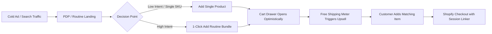

# UI/UX Research & D2C Skincare Benchmarks

> **Target:** Numa Skin Official Storefront ([numaskin.id](https://numaskin.id))
> **Scope:** Competitive UX Teardowns · D2C Global & Regional Benchmarks · Conversion Rate Optimization (CRO) Architecture · Indonesian Consumer Behavior

---

## 1. Executive Summary & Research Framework

To position **Numa Skin** as a premier Indonesian-Japanese clinical skincare brand, we conducted a rigorous benchmark analysis across top-tier global D2C innovators (**Rhode Skin**, **Glossier**, **Aesop**) and Southeast Asian market leaders (**Skintific**, **Somethinc**).

The central design dilemma in Indonesian beauty e-commerce is the tension between:
- **Aesthetic Prestige:** Clean, breathable, luxury-editorial typography and high-fashion model imagery (typical of global D2C flagships).
- **Conversion Velocity & Trust:** The acute need for reassurance among Indonesian buyers (BPOM registration, Halal certification, 14-day before/after proof, free shipping progress bars, and bundled savings).

### Strategic Verdict: The "J-Beauty Clinical Hybrid"
Numa Skin will adopt an architectural **hybrid model**:
1. **The Visual Surface of Rhode & Aesop:** Borderless cards, crisp typography (`DM Serif Display` + `Inter` + `JetBrains Mono`), delicate sea-mist surface tints (`#EBF5F8`), zero bubbly rounded badges, zero AI-slop icons.
2. **The Commercial Engine of Somethinc & Skintific:** Frictionless 4-step routine builder, clear bundle value savings matrix, mobile sticky Add-to-Cart drawer, real-time Free Shipping threshold meter, and prominent BPOM / Halal trust badges.

---

## 2. Competitive UX Teardown & Benchmark Matrix

| UX Dimension | Rhode Skin (US) | Skintific (ID/SEA) | Somethinc (ID) | Aesop (Global) | **Numa Skin Target** |
|:---|:---|:---|:---|:---|:---|
| **Design Aesthetic** | Editorial Ultra-Flat, Monochromatic | Clinical Consumer, High Contrast | Science & Trendy, Ingredient Heavy | Literary Luxury, Architectural Serenity | **J-Beauty Clinical Minimalism** |
| **Grid Architecture** | 4-col desktop, 2-col mobile, borderless | 2-col mobile, boxed shadow cards | 2-col mobile, badge-heavy | Asymmetrical, high whitespace | **4-col desktop, 2-col mobile, hairline border** |
| **Badge Styling** | Pure mono text, zero pill containers | Heavy gradient pills, icons | Gradient badges, promo tags | Zero badges, pure text | **Flat mono kicker (`font-mono text-[11px]`)** |
| **AOV Driver** | "The Rhode Kit" (Full Regimen Bundle) | 5X Ceramide Bundle Sets | Custom Routine Kits & Tiered Discounts | Minimal Bundles, Focus on Duos | **42 Pre-Configured Routine Bundles (30-45% OFF)** |
| **Cart Experience** | Slide-out Drawer with instant checkout | Direct to Checkout / Marketplace | Multi-step drawer with upsell | Full page cart / slide-over | **Optimistic Slide-out Drawer with Free Shipping Bar** |
| **Mobile PDP CTA** | Sticky bottom CTA bar | Sticky ATC + Marketplace buttons | Sticky ATC with variant picker | Static in-page button | **Sticky Mobile CTA with thumbnail & price** |
| **Ingredient Proof** | Minimalist key actives | 5X Ceramide diagram, 3D molecules | Percentage callouts (e.g. 10% Niacinamide) | Detailed botanical formulation notes | **Scientific percentages + Ulleung Water origin** |

---

## 3. Deep-Dive Benchmark Insights

### 3.1 Rhode Skin (by Hailey Bieber) — The Master of Clean Restraint
- **What Rhode Does Best:**
  - **Zero Visual Clutter:** No decorative badge icons or sparkly borders. Every product card feels like a page from an art book.
  - **Micro-Copy Restraint:** Short, punchy benefits. Instead of listing 20 paragraphs, Rhode highlights 3 clear actions (e.g., *Restores, Soothes, Glazes*).
  - **Regimen Thinking:** Products are sold as interlinked steps rather than isolated SKUs.
- **Application for Numa Skin:**
  - Adopt Rhode's typography scale and generous inter-section rhythm (~56px to 64px vertical spacing).
  - Maintain snug title-to-price spacing without artificial fixed card heights.

### 3.2 Skintific & Somethinc — The Indonesian Conversion Giants
- **What They Do Best:**
  - **Transparent Clinical Claims:** Indonesian skincare buyers demand verifiable safety. Highlighting **BPOM numbers** and **Halal certifications** immediately defuses counterfeit/safety anxieties.
  - **Before & After Visual Proof:** Clear photographic documentation of real skin changes over 14 to 28 days drastically boosts cold-traffic conversion from Meta and TikTok Ads.
  - **Bundling Psychology:** Single products hover around Rp 68.000 – Rp 109.000, but prominent "Paket 3-in-1" bundles priced at Rp 257.000 – Rp 297.000 yield a 2.8x higher Average Order Value.
- **Application for Numa Skin:**
  - Prominently feature the **#AwetMudaBersama 14-Day Challenge** with Brand Ambassadors Sahrul Gunawan & Dine Pearl.
  - Dedicate a bespoke homepage section to the **4-Step Routine Stepper** with 1-click bundle purchase.

### 3.3 Aesop — The Standard of Trust & Formulation Dignity
- **What Aesop Does Best:**
  - **Tabbed Sensory & Ingredient Disclosures:** High-detail breakdown of aroma, skin feel, key active ingredients, and application ritual.
  - **Calm, Reassuring Palette:** Organic, earth-and-water-inspired tones that instill instant psychological confidence.
- **Application for Numa Skin:**
  - Use our **Deep Marine Navy (`#132A5C`)**, **Ocean Cyan (`#269BA8`)**, and **Sea Mist (`#EBF5F8`)** to evoke pure marine hydration.
  - Implement a clean, accordion-based PDP specification tab for: *Manfaat Utama*, *Kandungan Aktif*, *Cara Pakai*, and *Nomor BPOM*.

---

## 4. Conversion Rate Optimization (CRO) Playbook

### 4.1 Frictionless PDP Mobile Architecture
1. **Immediate Price & Savings Comprehension:**
   - Display current discounted price in bold Navy (`Rp 79.000`).
   - Strikethrough normal price (`Rp 123.750`).
   - Clear savings pill: `HEMAT 36%`.
2. **Instant Variant Switching:**
   - For Treatment Lotion, clear toggle between `150ml (Full Size)` and `50ml (Travel Size)`.
   - Pure variant UI: suppress synthetic `Default Title` for single-variant products.
3. **Sticky Mobile Add-to-Cart Bar:**
   - Displays as soon as the user scrolls past the main CTA button.
   - Eliminates friction when the user is deep in reading reviews or ingredients.
4. **Routine Upsell Checkbox ("Lengkapi Perawatan Anda"):**
   - Directly underneath the Add-to-Cart button on the PDP, display the matching next step (e.g., on Facial Wash PDP, offer Treatment Lotion with `+ Tambah dengan Rp 79.000`).

### 4.2 Optimistic Cart Drawer & AOV Expansion
- **Sub-100ms Reaction Time:** Instant state updates using React Router v7 optimistic fetchers.
- **Free Shipping Threshold Bar:**
  - Threshold set at **Rp 200.000**.
  - Visual indicator: dynamically fills with oceanic cyan (`#269BA8`).
  - Nudge message: *"Tambah Rp 41.000 lagi untuk GRATIS ONGKIR ke seluruh Indonesia!"*.
- **In-Cart 1-Click Add-on:**
  - Showcase travel-friendly essentials (Treatment Lotion 50ml or Facial Wash) directly within the drawer.

### 4.3 Trust Anchors (Crucial for Indonesian E-Commerce)
- **Official BPOM Linker:** Every PDP features the active BPOM registration code (`NA18...`) with an official verification indicator.
- **Dermatologically Tested Guarantee:** Clear indicator that formulations are tested non-irritating for sensitive and acne-prone skin.
- **Direct WhatsApp Consultation:** Floating minimalist pill allowing uncertain buyers to ask skin-type questions directly to Numa Skin Beauty Advisors.

---

## 5. User Journey & Funnel Blueprints

### Journey 1: Cold Meta / TikTok Ad Traffic (Hero Serum Focus)
- **Landing:** `/products/numa-skin-nad-booster-anti-aging-serum-20ml`
- **Hook:** High-resolution product hero + Sahrul Gunawan video testimonial snippet.
- **Education:** Breakdown of 2% NAD+ cellular rejuvenation and Ulleung Island mineral water.
- **Conversion Pivot:** User sees *"Gunakan Bersama: Paket Anti-Aging Trio (Serum + Adenosine + Toner)"* with 36% savings.
- **Outcome:** Cart value elevates from Rp 108.999 to Rp 297.000.

### Journey 2: Brand Search / Homepage Discovery
- **Landing:** `/` (numaskin.id homepage)
- **Hook:** Full-bleed hero banner featuring radiant glass skin and brand slogan *"Muda untuk Masa Depan"*.
- **Interaction:** User engages with the interactive 4-Step Routine Stepper.
- **Action:** User selects their skin concern (*Anti-Aging / Flek Hitam*) and is routed to curated bundle collection.
- **Outcome:** Seamless addition of *Paket Complete Routine 4-in-1* into Cart Drawer.
